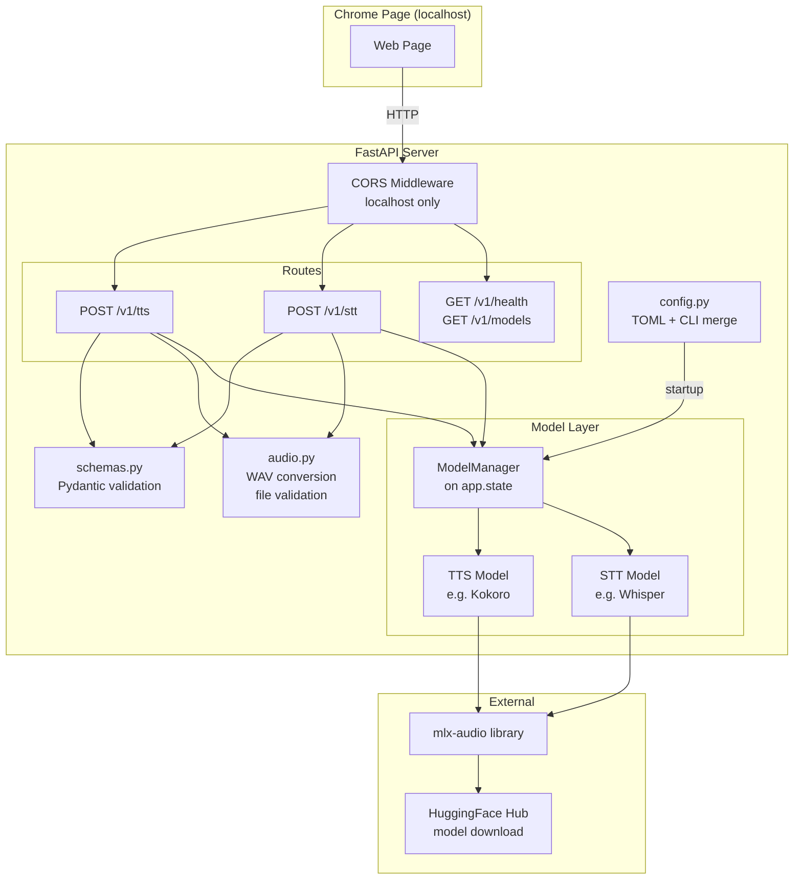
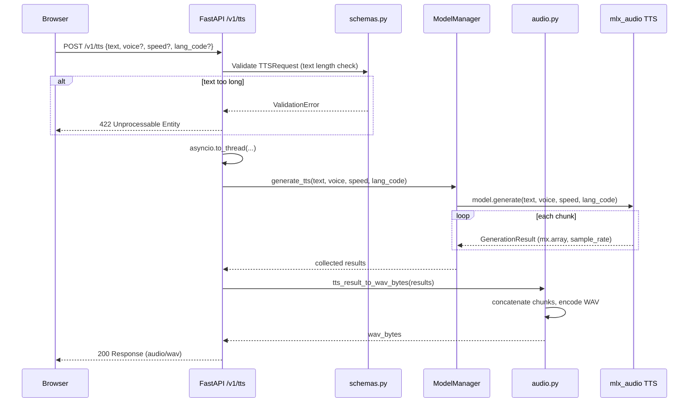
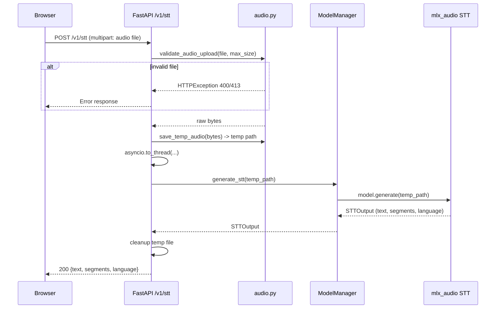

# Architecture: Conversational AI — TTS/STT API Server

## Overview

A localhost-only FastAPI server that wraps `mlx-audio` for text-to-speech and speech-to-text inference on Apple Silicon. Consumed by a Chrome web page via REST endpoints.

---

## File Structure

```
conversational_ai/
├── pyproject.toml              # Dependencies, project metadata
├── config.toml                 # Default configuration
├── main.py                     # Entry point: argparse, config, app factory, uvicorn
├── src/
│   ├── __init__.py
│   ├── config.py               # TOML loading + CLI override merging (Pydantic Settings)
│   ├── models.py               # ModelManager: singleton loader for TTS/STT models
│   ├── audio.py                # Audio conversion (mx.array -> WAV bytes), file validation
│   ├── schemas.py              # Pydantic request/response models
│   └── routes/
│       ├── __init__.py
│       ├── tts.py              # POST /v1/tts
│       ├── stt.py              # POST /v1/stt
│       └── system.py           # GET /v1/health, GET /v1/models
└── tests/
    ├── __init__.py
    ├── test_config.py
    ├── test_audio.py
    └── test_routes.py
```

---

## Component Architecture



---

## TTS Request Flow



---

## STT Request Flow



---

## Configuration

### config.toml

```toml
[server]
host = "127.0.0.1"
port = 8000

[tts]
model = "mlx-community/Kokoro-82M-bf16"
voice = "af_heart"
speed = 1.0
lang_code = "a"

[stt]
model = "mlx-community/whisper-large-v3-turbo-asr-fp16"

[limits]
max_text_length = 5000
max_audio_file_size = 26214400  # 25 MB
```

### CLI Overrides

CLI args map 1:1 and take precedence over the TOML file:

```
--config PATH           Path to TOML config file (default: ./config.toml)
--host HOST             Server bind address
--port PORT             Server port
--tts-model MODEL       TTS model name/path
--stt-model MODEL       STT model name/path
--voice VOICE           Default TTS voice
--speed SPEED           Default TTS speed
--lang-code CODE        Default TTS language code
--max-text-length N     Max input text characters
--max-audio-file-size N Max upload bytes
```

### Layering Order

1. Hardcoded defaults in Pydantic Settings model
2. TOML config file overrides defaults
3. CLI args override TOML values

---

## API Endpoints

| Method | Path          | Input                              | Output                                  |
|--------|---------------|------------------------------------|-----------------------------------------|
| POST   | `/v1/tts`     | JSON: `{text, voice?, speed?, lang_code?}` | `audio/wav` binary                |
| POST   | `/v1/stt`     | Multipart: audio file              | JSON: `{text, segments?, language?}`    |
| GET    | `/v1/health`  | None                               | JSON: `{status, tts_loaded, stt_loaded}`|
| GET    | `/v1/models`  | None                               | JSON: `{tts: {name, loaded}, stt: {name, loaded}}` |

---

## Key Design Decisions

| Decision | Rationale |
|----------|-----------|
| `asyncio.to_thread()` for inference | mlx calls block; keeps event loop responsive |
| ModelManager on `app.state` | Testable, no import-time side effects |
| TOML config via `tomllib` | stdlib in 3.11+, zero extra deps |
| Temp files for STT input | mlx-audio STT API requires file paths |
| No streaming in v1 | Simpler; TTS chunks concatenated server-side |
| 3 pinned deps only | fastapi, uvicorn, python-multipart; mlx-audio editable brings the rest |
| Localhost-only CORS | Security: not a public service |

---

## Dependencies

```
fastapi==0.115.12
uvicorn==0.34.2
python-multipart==0.0.20
mlx-audio (editable, ../mlx-audio with [all] extras)
```
