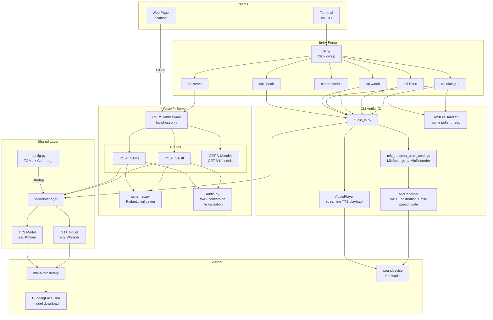
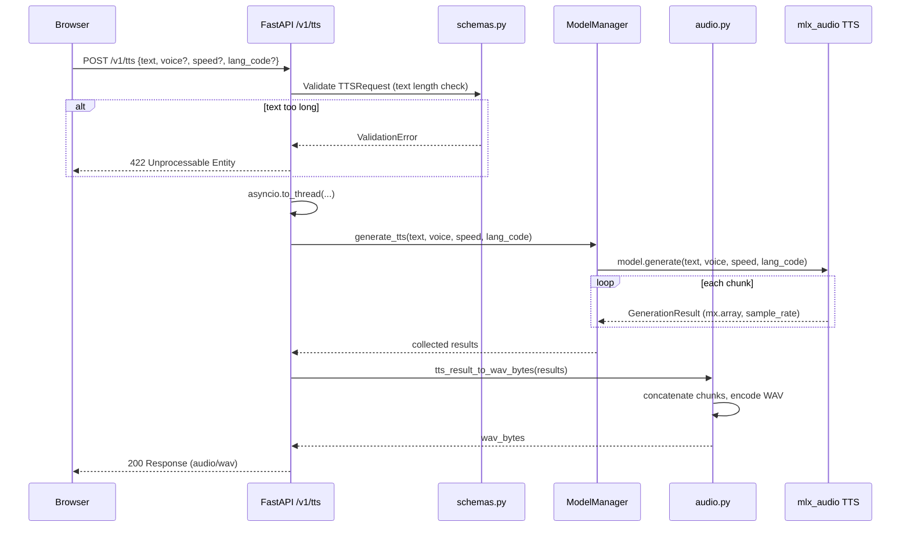
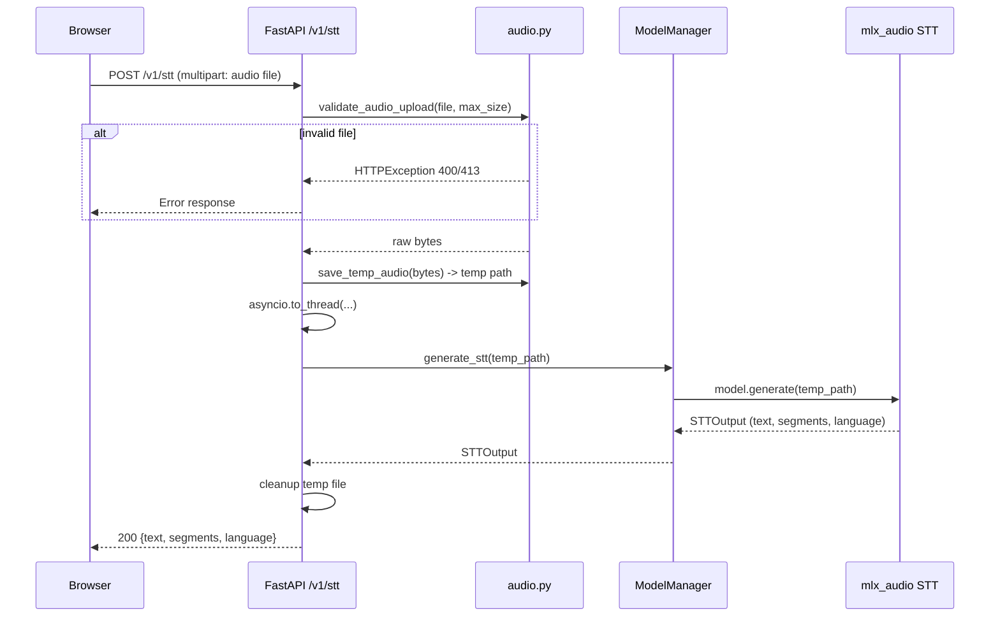
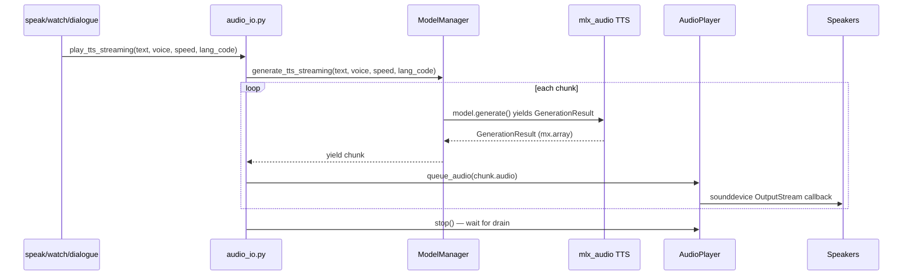
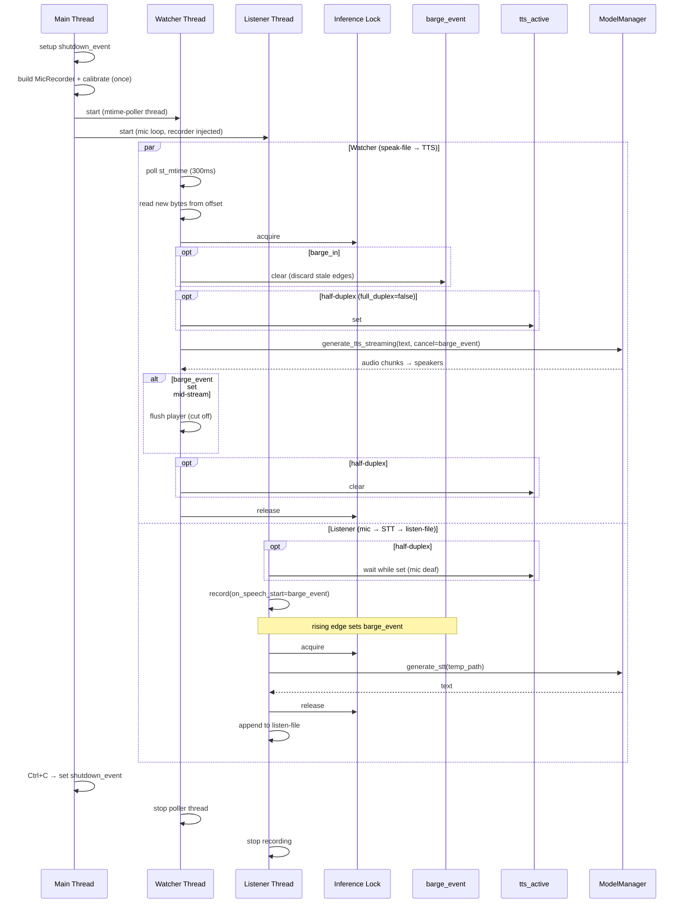

# Architecture: Conversational AI — CLI & HTTP API

## Overview

A local TTS/STT platform for Apple Silicon, built on `mlx-audio`. The primary
interface is the `cai` CLI (speak, transcribe, watch, listen, dialogue). A
companion HTTP API (`cai serve`) exposes the same models to browser-based
clients that cannot invoke the CLI directly. Both share one model layer and
one configuration tree.

- **CLI** (default) — Click-based terminal interface: file-driven dictation,
  streaming TTS playback, VAD-gated mic recording, and a two-way dialogue
  mode with barge-in and duplex controls.
- **HTTP API** (`cai serve`) — FastAPI endpoints at `127.0.0.1:4114` consumed
  by localhost web pages.

---

## File Structure

```
conversational_ai/
├── pyproject.toml              # Dependencies, project metadata
├── cli.py                      # Click entry point — re-exports `src.cli.cli`
├── main.py                     # FastAPI app factory + uvicorn (used by `cai serve`)
├── PRD.md                      # Product requirements document
├── install.sh                  # Installs to ~/.local/share, creates ~/.local/bin/cai
├── src/
│   ├── __init__.py
│   ├── config.py               # XDG TOML loading + CLI override merging (Pydantic)
│   ├── models.py               # ModelManager: loader + inference for TTS/STT
│   ├── audio.py                # WAV encoding, upload validation, temp files
│   ├── schemas.py              # Pydantic request/response models
│   ├── middleware.py           # X-Limit-* response headers
│   ├── logging_setup.py        # Log rotation + setup
│   ├── routes/
│   │   ├── __init__.py
│   │   ├── tts.py              # POST /v1/tts
│   │   ├── stt.py              # POST /v1/stt
│   │   └── system.py           # GET /v1/health, GET /v1/models
│   └── cli/
│       ├── __init__.py         # Click group, shared startup (config + model loading)
│       ├── audio_io.py         # Speaker playback + mic recording primitives
│       ├── serve.py            # `cai serve` — start the HTTP API
│       ├── speak.py            # `cai speak` — text → TTS → speakers
│       ├── transcribe.py       # `cai transcribe` — mic → STT → stdout
│       ├── watch.py            # `cai watch` — file changes → TTS → speakers
│       ├── listen.py           # `cai listen` — mic → STT → append to file
│       └── dialogue.py         # `cai dialogue` — watch + listen simultaneously
└── tests/
    ├── __init__.py
    ├── test_config.py          # TOML + CLI override merge, section validators
    ├── test_audio.py           # WAV encoding, upload validation
    ├── test_schemas.py         # Pydantic request/response models
    ├── test_middleware.py      # X-Limit-* headers on 2xx and error paths
    ├── test_models.py          # ModelManager load + inference wrappers
    ├── test_routes.py          # Route handlers with FakeModelManager
    ├── test_integration.py     # Full app stack with fake inference
    ├── test_cli_audio_io.py    # MicRecorder VAD, calibration, min-speech gate
    └── test_cli_subcommands.py # Click subcommands via CliRunner
```

The default `config.toml` template is bootstrapped at
`~/.config/conversational_ai/config.toml` on first run by
`ensure_xdg_config()` in `src/config.py`. The in-repo `config.toml` is no
longer read at runtime.

---

## Component Architecture



---

## TTS Request Flow



---

## STT Request Flow



---

## Configuration

### config.toml (XDG)

Location: `~/.config/conversational_ai/config.toml`. Created with the default
template below on first run by `ensure_xdg_config()` in `src/config.py`.

```toml
[server]
host = "127.0.0.1"
port = 4114

[tts]
model = "mlx-community/Kokoro-82M-bf16"
voice = "af_heart"
speed = 1.0
lang_code = "a"

[stt]
model = "mlx-community/whisper-large-v3-turbo-asr-fp16"

[models]
models_dir = "~/.lmstudio/models"

[dialogue]
speak_file = "~/.local/share/conversational_ai/speak.txt"
listen_file = "~/.local/share/conversational_ai/listen.txt"
barge_in = true     # VAD rising edge cancels in-flight TTS
full_duplex = true  # mic stays hot while TTS is playing

[mic]
rms_threshold = 0.01          # RMS above which a chunk counts as speech
silence_seconds = 1.5         # trailing silence that ends an utterance
min_speech_seconds = 0.15     # sustained speech required to latch (filters transients)
calibrate_noise = false       # sample room tone at startup
calibration_seconds = 1.0
calibration_multiplier = 3.0

[limits]
max_text_length = 5000
max_audio_file_size = 26214400  # 25 MB

[log]
log_dir = "~/.local/state/conversational_ai"
max_age_days = 7
```

`[wake_word]` is reserved for the planned wake-word detector (see
`tasks/TODO.md` Feature 2) — not yet loaded.

### CLI Overrides

**Global** (before subcommand):

```
--config PATH           Path to TOML config file (overrides XDG path)
--tts-model MODEL       TTS model name/path
--stt-model MODEL       STT model name/path
--voice VOICE           Default TTS voice
--speed SPEED           Default TTS speed (0.1–5.0)
--lang-code CODE        Default TTS language code
--models-dir DIR        Local models directory (default: ~/.lmstudio/models)
--no-tts                Skip loading the TTS model
--no-stt                Skip loading the STT model
```

**Per-subcommand** — mic controls (shared by `transcribe`, `listen`, `dialogue`):

```
--mic-threshold FLOAT                  Override RMS threshold
--mic-silence SECONDS                  Trailing silence to end an utterance
--mic-min-speech SECONDS               Sustained speech needed to latch
--calibrate-noise / --no-calibrate-noise
                                       Sample room tone at startup
```

**`cai dialogue` additional flags**:

```
--speak-file PATH   Override [dialogue].speak_file (file to read + speak)
--listen-file PATH  Override [dialogue].listen_file (file to append STT to)
```

### Layering Order

1. Hardcoded defaults in Pydantic `Settings` model
2. XDG TOML file overrides defaults (or `--config PATH` if given)
3. CLI args override TOML values (non-`None` values only)

---

## API Endpoints

| Method | Path          | Input                              | Output                                  |
|--------|---------------|------------------------------------|-----------------------------------------|
| POST   | `/v1/tts`     | JSON: `{text, voice?, speed?, lang_code?}` | `audio/wav` binary                |
| POST   | `/v1/stt`     | Multipart: audio file              | JSON: `{text, segments?, language?}`    |
| GET    | `/v1/health`  | None                               | JSON: `{status, tts_loaded, stt_loaded}`|
| GET    | `/v1/models`  | None                               | JSON: `{tts: {name, loaded}, stt: {name, loaded}}` |

---

## Key Design Decisions

| Decision | Rationale |
|----------|-----------|
| `asyncio.to_thread()` for inference | mlx calls block; keeps event loop responsive |
| ModelManager on `app.state` | Testable, no import-time side effects |
| TOML config via `tomllib` | stdlib in 3.11+, zero extra deps |
| Temp files for STT input | mlx-audio STT API requires file paths |
| No streaming in v1 | Simpler; TTS chunks concatenated server-side |
| Minimal pinned deps | click, fastapi, uvicorn, python-multipart, transformers; mlx-audio editable brings the rest |
| Localhost-only CORS | Security: not a public service |
| Duplex dialogue via two flags | `barge_in` + `full_duplex` cover the 4 useful combinations (headphones, open-speaker, loopback, walkie-talkie) without mode enums |

---

---

## CLI Architecture

### Click Command Hierarchy

```
cai (Click group)
├── serve         Start the HTTP API server
├── speak         Text → TTS → speakers
├── transcribe    Mic → STT → stdout
├── watch FILE    File changes → TTS → speakers
├── listen FILE   Mic → STT → append to file
└── dialogue      Watch + listen simultaneously
```

Global options (before subcommand): `--config`, `--tts-model`, `--stt-model`, `--voice`,
`--speed`, `--lang-code`, `--models-dir`, `--no-tts`, `--no-stt`. See
**Configuration → CLI Overrides** above for per-subcommand mic flags.

### Streaming TTS Playback Flow



### Microphone Recording Flow

```mermaid
sequenceDiagram
    participant CMD as transcribe/listen/dialogue
    participant MF as mic_recorder_from_settings
    participant MR as MicRecorder
    participant SD as sounddevice InputStream
    participant MIC as Microphone
    participant MM as ModelManager
    participant MLX as mlx_audio STT

    CMD->>MF: build from MicSettings (+ CLI overrides)
    MF-->>CMD: MicRecorder instance
    opt calibrate_noise
        CMD->>MR: calibrate()
        MR->>SD: short InputStream (calibration_seconds)
        MIC-->>SD: room tone
        MR->>MR: effective = max(configured, floor × multiplier)
    end
    CMD->>MR: record(on_speech_start=barge_event?)
    MR->>SD: start InputStream (16kHz mono)
    loop audio chunks
        MIC-->>SD: raw frames
        SD-->>MR: chunk callback
        MR->>MR: RMS; push to pre-latch ring
        alt N consecutive loud chunks<br/>(min_speech_chunks)
            MR->>MR: flush ring → audio; set on_speech_start
        end
        alt latched + trailing silence ≥ silence_seconds
            MR->>MR: update EMA floor; recompute effective threshold
            MR->>SD: stop InputStream
        end
    end
    MR->>MR: save to temp WAV
    MR-->>CMD: temp file path
    CMD->>MM: generate_stt(temp_path)
    MM->>MLX: model.generate(path)
    MLX-->>MM: STTOutput
    MM-->>CMD: text
    CMD->>CMD: cleanup temp file
```

**MicRecorder behavior** (`src/cli/audio_io.py`):

- **Min-speech gate** — requires `min_speech_chunks` consecutive above-threshold
  chunks before latching. Streak resets on any silent chunk. Filters single
  transients (keyboard clacks, door slams).
- **Pre-latch ring buffer** — all recent chunks (loud + silent) are kept in a
  ring sized `min_speech_chunks + pre_speech_chunks`. When the gate trips,
  the ring is flushed into the recording so the utterance's leading edge is
  preserved.
- **Noise calibration** — opt-in pass that samples room tone for
  `calibration_seconds` and raises the effective threshold to
  `max(rms_threshold, measured_floor × calibration_multiplier)`. `listen` and
  `dialogue` amortize it once at startup; `transcribe` skips by default.
- **Adaptive EMA floor** — once calibrated, silence-chunk RMS values feed an
  exponential moving average that drifts the effective threshold as room
  conditions change over the session (B1 in `tasks/BUGS.md`).
- **`on_speech_start` signal** — a `threading.Event` set on the rising edge of
  the gate. `dialogue` wires this into `play_tts_streaming(cancel=…)` to
  implement barge-in.

### Dialogue Mode Threading

Two orthogonal flags in `[dialogue]` control duplex behavior:

- `barge_in` — when true, a mic rising edge (`on_speech_start`) fires
  `barge_event`, which `play_tts_streaming(cancel=…)` consumes to flush the
  `AudioPlayer` immediately. Mid-sentence TTS stops the moment the user
  starts talking.
- `full_duplex` — when true, the mic stays hot during TTS playback. When
  false, `tts_active` gates the listener loop so the mic is deaf while TTS
  is speaking (open-speaker safety; mic can't hear the model's own output).

The four combinations are documented in `README.md` § "Dialogue duplex modes".



### File Watcher Design

- Pure stdlib `TextFileHandler` worker thread — no `watchdog`, no FSEvents,
  no inotify. See `tasks/04-11-2026-BUGS.md` § P10 for the historical
  rationale behind removing the event-driven observer.
- Polls `path.stat().st_mtime` on a 300ms interval (`_POLL_INTERVAL` in
  `src/cli/watch.py`) and tracks the byte offset of the last read. On each
  tick where `mtime` advanced:
  1. `seek` to last known offset, read to EOF.
  2. If file size < offset (truncation), reset offset to 0 and re-read.
  3. Feed new text to TTS playback.
- Worst-case detect-to-speak latency is ~300ms (one poll interval). The
  polling interval doubles as a natural debounce — rapid successive writes
  that land within one tick are coalesced into a single read.

### Concurrency Model

Threading (not asyncio) throughout the CLI:
- `sounddevice` uses PortAudio callbacks (thread-based).
- The mtime-poller file watcher runs on its own worker thread.
- MLX inference is blocking CPU/GPU work.
- A shared `threading.Lock` serializes all inference calls (MLX is not thread-safe
  for concurrent operations).
- A shared `threading.Event` coordinates graceful shutdown across threads.

---

## Dependencies

```
click==8.1.8
fastapi==0.115.12
uvicorn==0.34.2
python-multipart==0.0.20
transformers==5.3.0
mlx-audio (editable, ../mlx-audio with [all] extras)
```

`sounddevice`, `soundfile`, and `numpy` are transitive deps via
`mlx-audio[all]`. `transformers` is pinned to `5.3.0` — see
`CONTRIBUTING.md` § "Known dependency constraint" for the reason (a symbol
imported by 5.4+ does not yet exist in any released `mistral_common`).
