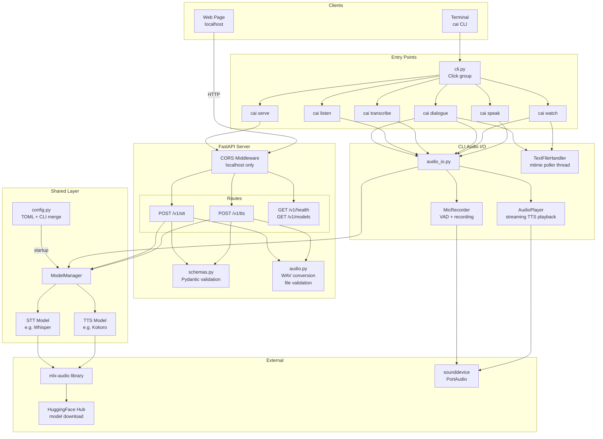
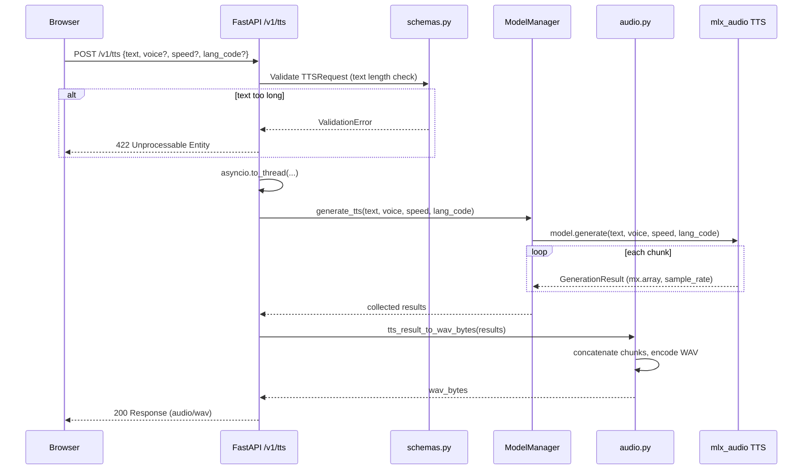
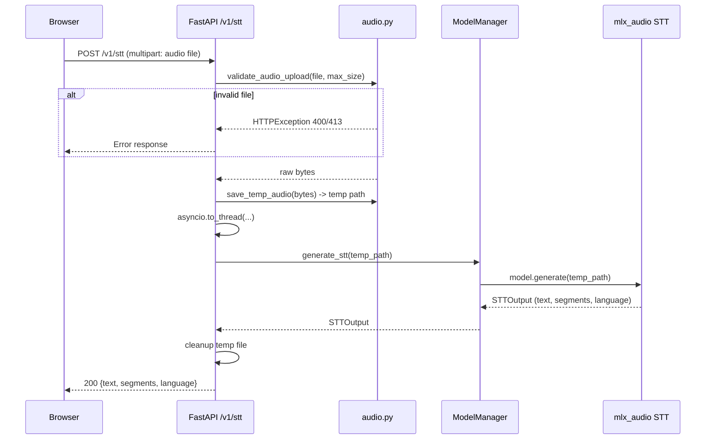
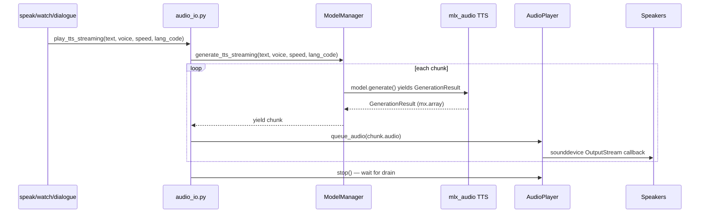
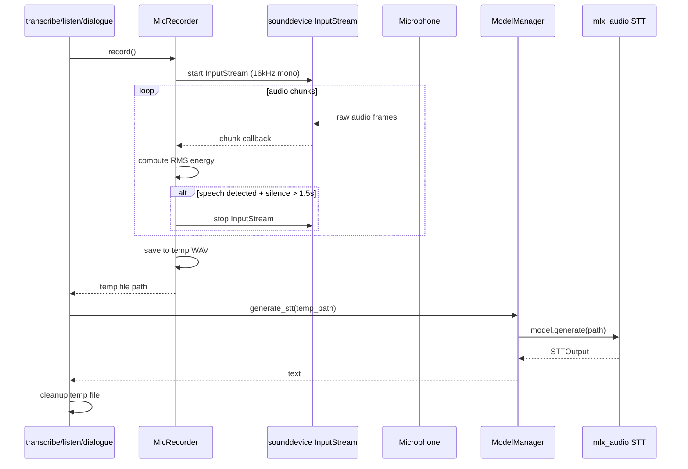
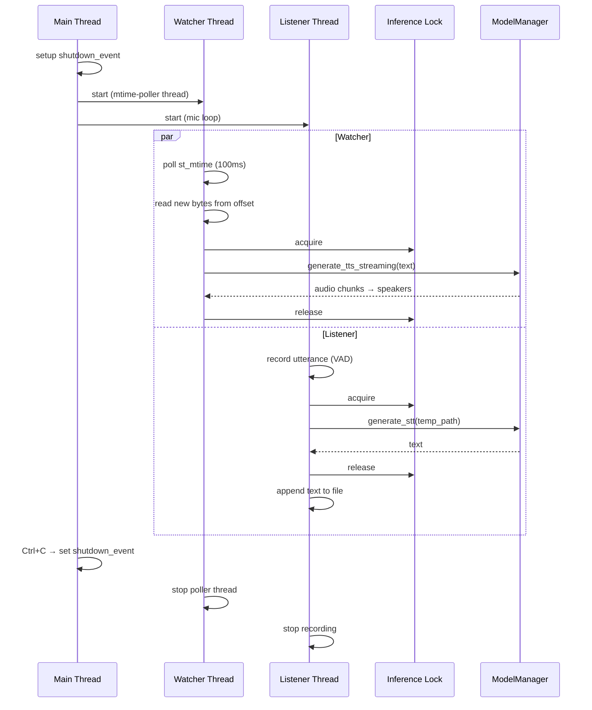

# Architecture: Conversational AI — TTS/STT Server & CLI

## Overview

A localhost-only TTS/STT platform for Apple Silicon, built on `mlx-audio`. Two interfaces
share the same model layer and configuration:

1. **HTTP API Server** — FastAPI endpoints consumed by web pages and HTTP clients.
2. **CLI** — Click-based terminal interface with speaker output, microphone input,
   file watching, and a dialogue mode.

Both are accessed through the unified `cai` command (`cai serve`, `cai speak`, etc.).

---

## File Structure

```
conversational_ai/
├── pyproject.toml              # Dependencies, project metadata
├── config.toml                 # Default configuration (deprecated — XDG used)
├── cli.py                      # Click entry point — unified `cai` command
├── main.py                     # FastAPI app factory + uvicorn (used by `cai serve`)
├── PRD.md                      # Product requirements document
├── install.sh                  # Installs to ~/.local/share, creates ~/.local/bin/cai
├── src/
│   ├── __init__.py
│   ├── config.py               # TOML loading + CLI override merging (Pydantic Settings)
│   ├── models.py               # ModelManager: loader + inference for TTS/STT
│   ├── audio.py                # WAV encoding, upload validation, temp files
│   ├── schemas.py              # Pydantic request/response models
│   ├── middleware.py            # X-Limit-* response headers
│   ├── logging_setup.py         # Log rotation + setup
│   ├── routes/
│   │   ├── __init__.py
│   │   ├── tts.py              # POST /v1/tts
│   │   ├── stt.py              # POST /v1/stt
│   │   └── system.py           # GET /v1/health, GET /v1/models
│   └── cli/
│       ├── __init__.py         # Click group, shared startup (config + model loading)
│       ├── audio_io.py         # Speaker playback + mic recording primitives
│       ├── speak.py            # `cai speak` — text → TTS → speakers
│       ├── transcribe.py       # `cai transcribe` — mic → STT → stdout
│       ├── watch.py            # `cai watch` — file changes → TTS → speakers
│       ├── listen.py           # `cai listen` — mic → STT → append to file
│       └── dialogue.py         # `cai dialogue` — watch + listen simultaneously
└── tests/
    ├── __init__.py
    ├── test_config.py
    ├── test_audio.py
    ├── test_schemas.py
    ├── test_routes.py
    └── test_cli_audio_io.py    # Unit tests for CLI audio primitives
```

---

## Component Architecture



---

## TTS Request Flow



---

## STT Request Flow



---

## Configuration

### config.toml

```toml
[server]
host = "127.0.0.1"
port = 8000

[tts]
model = "mlx-community/Kokoro-82M-bf16"
voice = "af_heart"
speed = 1.0
lang_code = "a"

[stt]
model = "mlx-community/whisper-large-v3-turbo-asr-fp16"

[limits]
max_text_length = 5000
max_audio_file_size = 26214400  # 25 MB
```

### CLI Overrides

CLI args map 1:1 and take precedence over the TOML file:

```
--config PATH           Path to TOML config file (default: ./config.toml)
--host HOST             Server bind address
--port PORT             Server port
--tts-model MODEL       TTS model name/path
--stt-model MODEL       STT model name/path
--voice VOICE           Default TTS voice
--speed SPEED           Default TTS speed
--lang-code CODE        Default TTS language code
--max-text-length N     Max input text characters
--max-audio-file-size N Max upload bytes
```

### Layering Order

1. Hardcoded defaults in Pydantic Settings model
2. TOML config file overrides defaults
3. CLI args override TOML values

---

## API Endpoints

| Method | Path          | Input                              | Output                                  |
|--------|---------------|------------------------------------|-----------------------------------------|
| POST   | `/v1/tts`     | JSON: `{text, voice?, speed?, lang_code?}` | `audio/wav` binary                |
| POST   | `/v1/stt`     | Multipart: audio file              | JSON: `{text, segments?, language?}`    |
| GET    | `/v1/health`  | None                               | JSON: `{status, tts_loaded, stt_loaded}`|
| GET    | `/v1/models`  | None                               | JSON: `{tts: {name, loaded}, stt: {name, loaded}}` |

---

## Key Design Decisions

| Decision | Rationale |
|----------|-----------|
| `asyncio.to_thread()` for inference | mlx calls block; keeps event loop responsive |
| ModelManager on `app.state` | Testable, no import-time side effects |
| TOML config via `tomllib` | stdlib in 3.11+, zero extra deps |
| Temp files for STT input | mlx-audio STT API requires file paths |
| No streaming in v1 | Simpler; TTS chunks concatenated server-side |
| 3 pinned deps only | fastapi, uvicorn, python-multipart; mlx-audio editable brings the rest |
| Localhost-only CORS | Security: not a public service |

---

---

## CLI Architecture

### Click Command Hierarchy

```
cai (Click group)
├── serve         Start the HTTP API server
├── speak         Text → TTS → speakers
├── transcribe    Mic → STT → stdout
├── watch FILE    File changes → TTS → speakers
├── listen FILE   Mic → STT → append to file
└── dialogue      Watch + listen simultaneously
```

Global options (before subcommand): `--config`, `--tts-model`, `--stt-model`, `--voice`,
`--speed`, `--lang-code`, `--no-tts`, `--no-stt`.

### Streaming TTS Playback Flow



### Microphone Recording Flow



### Dialogue Mode Threading



### File Watcher Design

- Pure stdlib `TextFileHandler` worker thread — no `watchdog`, no FSEvents,
  no inotify. See P10 in `tasks/BUGS.md` for the rationale.
- Polls `path.stat().st_mtime` on a 100ms interval and tracks the byte offset
  of the last read. On each tick where `mtime` advanced:
  1. `seek` to last known offset, read to EOF.
  2. If file size < offset (truncation), reset offset to 0 and re-read.
  3. Feed new text to TTS playback.
- Worst-case detect-to-speak latency is ~100ms (one poll interval), vs. the
  ~0–50ms FSEvents latency plus the 300ms debounce the old design needed.

### Concurrency Model

Threading (not asyncio) throughout the CLI:
- `sounddevice` uses PortAudio callbacks (thread-based).
- The mtime-poller file watcher runs on its own worker thread.
- MLX inference is blocking CPU/GPU work.
- A shared `threading.Lock` serializes all inference calls (MLX is not thread-safe
  for concurrent operations).
- A shared `threading.Event` coordinates graceful shutdown across threads.

---

## Dependencies

```
fastapi==0.115.12
uvicorn==0.34.2
python-multipart==0.0.20
click==8.1.8
mlx-audio (editable, ../mlx-audio with [all] extras)
```

`sounddevice` and `soundfile` are transitive deps via `mlx-audio[all]`.
